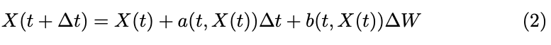

Part of a college assignment...

# SDE Methods
This program compares two discretisation schemes, Euler-Maruyama and Milstein, with the exact solution for GBM. The 
stochastic differential equations (S.D.Es) are solved using Monte Carlo simulation.


## Contents

1. [Overview](#overview)
2. [Requirements](#requirements)
3. [Compilation and Usage](#compilation-and-usage)
4. [Known Issues](#known-issues)

## Overview

Given a Stochastic Differential Equation (SDE) of the form:


where W is a Wiener process. We can do an Itˆo-Taylor expansion of Eq. 1 to various orders in order to obtain a discrete
approximation of the dynanmics. The first order expansion gives us the Euler-Maruyama Scheme:



The Euler-Maruyama method has error O(∆t). If we add the next order term
in the expansion we get the Milstein Scheme:


The Milstein method has error O(∆t2).

Under the assumption of Geometric Brownian Motion, Eq. 1 becomes:


and the Euler-Maruyama scheme becomes:


with z ∼ N(0,1) is a standard normal random variate. The Milstein scheme becomes:


However we can also integrate up Eq. 4 to obtain the exact scheme:


This program compares Eq. 5, Eq. 6 and Eq. 7.

The program also makes exercises good practical use of smart pointers, polymorphism, random number generation and 
valarrays.

In particular, a std::vector<std::valarray<double>> prices_ is used effectively to perform N * num_timestep simulations
of the stock price as it moves through time. This is because the std::valarray allows for BLAS like operations such as (*)
which multiplies all of its elements by a given number. This fits in nicely with our equation as we move through time.


## Requirements

- gcc
- gnuplot (if you would like to produce graphics)

## Compilation and Usage

To compile the code simply run the following command inside a terminal in the project directory:

```shell
make
```

To run the program, simply run the following command inside a terminal in the project directory:

```shell
./sde_methods
```

To produce graphics, run the following commands inside the gnuplot terminal in the project directory:

```shell
set grid ytics lt 0 lw 1 lc rgb "#bbbbbb"
set grid xtics lt 0 lw 1 lc rgb "#bbbbbb"
set title "Distribution at T = 1 for 10 timesteps"
set samples 50 # Adjust this at your own leisure
plot 'EX_time_1_timesteps_10.txt'  w l t "Exact Scheme", 'EM_time_1_timesteps_10.txt' smooth csplines w l t "
Euler-Maruyama", 'M_time_1_timesteps_10.txt' smooth csplines w l t 'Milstein'
```

Note: I know I can add this to the Makefile as 'make plot' but I prefer to leave the commands here so I can return to them.

## Results

The following are the results for t = 1 and 10 timesteps:

```shell
Constructor for 100000 Gaussian variates constructing.
Creating vector with Mersenne Twister state-size [312].
Exact_path constructor constructing.
Exact_path destructor
Simulation destructor
Constructor for Milstein scheme constructing.
Milstein destructor
Simulation destructor
Constructor for Euler-Maruyama scheme constructing.
Euler-Maruyama destructor
Simulation destructor

Writing results to file: EX_time_1_timesteps_10.txt
Writing results to file: M_time_1_timesteps_10.txt
Writing results to file: EM_time_1_timesteps_10.txt

Expected value Exact: 104.932
Variance Exact: 433.293


Expected value Milstein: 104.92
Variance Exact Milstein: 428.817


Expected value Euler-Maruyama: 104.92
Variance Exact Euler-Maruyama: 428.353

Writing results to file: EX_time_1_log_rets_at_timestep10.txt

Expected Exact log returns: 0.0288267
Variance Exact log returns: 0.038675

Euler-Maruyama destructor
Simulation destructor
Milstein destructor
Simulation destructor
Exact_path destructor
Simulation destructor

```


## Known Issues

None at present.
